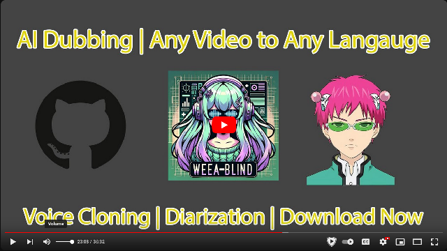

# Weeablind

A program to dub multi-lingual media and anime using modern AI speech synthesis, diarization, language identification, and voice cloning.


## [Download Release 1.0](https://github.com/florianeagox/weeablind/releases)

You can try the first binary version which has access to basic dubbing features with the non-AI based libraries for Windows and Linux. This is a good way to try out the program and you can still do basic dubbing with the system voices. If you want to use the advanced features' you'll have to try out the advanced features as described in the setup tutorial.

## Live Demo and Tutorial

I made this video to show off how to use all the features and everything the softwwware can do presently

[](https://youtu.be/V1RDwXwmjFA)

## Why

Many shows, movies, news segments, interviews, and videos will never receive proper dubs to other languages, and dubbing something from scratch can be an enormous undertaking. This presents a common accessibility hurdle for people with blindness, dyslexia, learning disabilities, or simply folks that don't enjoy reading subtitles. This program aims to create a pleasant alternative for folks facing these struggles.

This software is a product of war. My sister turned me onto my now-favorite comedy anime "The Disastrous Life of Saiki K." but Netflix never ordered a dub for the 2nd season. I'm blind and cannot and will not ever be able to read subtitles, but I MUST know how the story progresses! Netflix has forced my hand and I will bring AI-dubbed anime to the blind!

## How

This project relies on some rudimentary slapping together of some state of the art technologies. It uses numerous audio processing libraries and techniques to analyze and synthesize speech that tries to stay in-line with the source video file. It primarily relies on ffmpeg and pydub for audio and video editing, Coqui TTS for speech synthesis, speechbrain for language identification, and pyannote.audio for speaker diarization.

You have the option of dubbing every subtitle in the video, setting the s tart and end times, dubbing only foreign-language content, or full-blown multi-speaker dubbing with speaking rate and volume matching.

## When?

This project is currently what some might call in alpha. The major, core functionality is in place, and it's possible to use by cloning the repo, but it's only starting to be ready for a first release. There are numerous optimizations, UX, and refactoring that need to be done before I would call it finished. Stay tuned for regular updates, and feel free to extend a hand with contributions, testing, or suggestions if this is something you're interested in.

## The Name

I had the idea to call the software Weeablind as a portmanteaux of Weeaboo (someone a little too obsessed with anime), and blind. I might change it to something else in the future like Blindtaku, DubHub, or something similar and more catchy because the software can be used for far more than just anime.

## Setup

There are currently no prebuilt-binaries to download, this is something I am looking into, but many of these dependencies are not easy to bundle with something like PyInstaller

The program works best on Linux, but will also run on Windows.

### System Prerequisits
You will need to install [FFmpeg](https://ffmpeg.org/download.html) on your system and make sure it's callable from terminal or in your system PATH

For using Coqui TTS, you will also need Espeak-NG which you can get from your package manager on Linux or [here](https://github.com/espeak-ng/espeak-ng/releases) on Windows

On Windows, pip requires MSVC Build Tools to build Coqui. You can install it here:
https://visualstudio.microsoft.com/visual-cpp-build-tools/

Coqui TTS and Pyannote diarization will also both perform better if you have CUDA set up on your system to use your GPU. This should work out of the box on Linux but getting it set up on Windows takes some doing. This [blog post](https://saturncloud.io/blog/how-to-run-mozilla-ttscoqui-tts-training-with-cuda-on-a-windows-system/) should walk you through the process. If you can't get it working, don't fret, you can still use them on your CPU.

The latest version of Python works on Linux, but Spleeter only works on 3.10 and Pyannote can be finicky with that too. 3.10 seems to work the best on on Windows. You can get it from the Microsoft Store.

### Setup from Source
To use the project, you'll need to clone the repository and install the dependencies in a virtual enviormonet.

```
git clone https://github.com/FlorianEagox/weeablind.git
cd weeablind
python3.10 -m venv venv
# Windows
.\venv\Scripts\activate
# Linux
source ./venv/bin/activate
```
This project has a lot of dependencies, and pip can struggle with conflicts, so it's best to install from the lock file like this:
```
pip install -r requirements-win-310.txt --no-deps
```
You can try from the regular requirements file, but it can take a heck of a long time and requires some rejiggering sometimes. 

Installing the dependencies can take a hot minute and uses a lot of space (~8 GB).

If you don't need certain features for instance, language filtering, you can omit speechbrain from the readme. 

once this is completed, you can run the program with

```
python weeablind.py
```

## Usage
Start by either selecting a video from your computer or pasting a link to a YT video and pressing enter. It should download the video and lot the subs and audio.

### Loading a video
Once a video is loaded, you can preview the subtitles that will be dubbed. If the wrong language is loaded, or the wrong audio stream, switch to the streams tab and select the correct ones.

### Cropping
You can specify a start and end time if you only need to dub a section of the video, for example to skip the opening theme and credits of a show. Use timecode syntax like 2:17 and press enter. 

### Configuring Voices
By default, a "Sample" voice should be initialized. You can play around with different configurations and test the voice before dubbing with the "Sample Voice" button in the "Configure Voices" tab. When you have parameters you're happy with, clicking "Update Voices" will re-asign it to that slot. If you choose the SYSTEM tts engine, the program will use Windows' SAPI5 Narrorator or Linux espeak voices by default. This is extremely fast but sounds very robotic. Selecting Coqui gives you a TON of options to play around with, but you will be prompted to download often very heavy TTS models. VCTK/VITS is my favorite model to dub with as it's very quick, even on CPU, and there are hundreds of speakers to choose from. It is loaded by default. If you have ran diarization, you can select different voices from the listbox and change their properties as well.

### Language Filtering
In the subtitles tab, you filter the subtitles to exclude lines spoken in your selected language so only the foreign language gets dubbed. This is useful for multi-lingual videos, but not videos all in one language.

### Diarization
Running diarization will attempt to assign the correct speaker to all the subtitles and generate random voices for the total number of speakers detected. In the futre, you'll be able to specify the diarization pipeline and number of speakers if you know ahead of time. Diarization is only useful for videos with multiple speakers and the accuracy can very massively.

### Background Isolation
In the "Streams" tab, you can run vocal isolation which will attempt to remove the vocals from your source video track but retain the background. If you're using a multi-lingual video and running language filtering as well, you'll need to run that first to keep the english (or whatever source language's vocals).

### Dubbing
Once you've configured things how you like, you can press the big, JUICY run dubbing button. This can take a while to run. Once completed, you should have something like "MyVideo-dubbed.mkv" in the `output` directory. This is your finished video!

## Things to do
- ~~A better filtering system for language detection. Maybe inclusive and exclusive or confidence threshhold~~
- Find some less copyrighted multi-lingual / non-english content to display demos publicly
- ~~de-anglicanization it so the user can select their target language instead of just English~~
- FIX PYDUB'S STUPID ARRAY DISTORTION so we don't have to perform 5 IO operations per dub!!!
- ~~run a vocal isolation / remover on the source audio to remove / mitigate the original speakers?~~
- ~~A proper setup guide for all platforms~~
- ~~remove or fix the broken espeak implementation to be cross-platform~~
- ~~Uninitialized, singletons for heavy models upon startup (e.g. only intialize pyannote/speechbrain pipelines when needed)~~
- Abstraction for singletons of Coqui voices using the same model to reduce memory footprint
- ~~GUI tab to list and select audio / subtitle streams w/ FFMPEG~~
- ~~Move the tabs into their own classes~~
- ~~Add labels and screen reader landmarks to all the controls~~
- ~~Single speaker or multi speaker control switch~~
- ~~Download YouTube video with Closed Captions~~
- ~~GUI to select start and end time for dubbing~~
- Throw up a Flask server on my website so you can try it with minimal features.
- ~~Use OCR to generate subtitles for videos that don't have sub streams~~
- ~~Use OCR for non-text based subtitles~~
- ~~Make a cool logo?~~
- ~~Learn how to package python programs as binaries to make releases~~
- ~~Remove the copyrighted content from this repo (sorry not sorry TV Tokyo)~~
- ~~Support for all subtitle formats~~
- Maybe slap in an ASR library for videos without subtitles?
- Maybe support for magnet URLs or the arrLib to pirate media (who knows???)

### Diarization
- Filter subtitles by the selected voice from the listbox
- Select from multiple diarization models / pipelines
- Optimize audio trakcs for diarizaiton by isolating lines speech based on subtitle timings
- Investigate Diart?

### TTS

- ~~Rework the speed control to use PyDub to speed up audio.~~
- ~~match the volume of the speaker to TTS~~
- Checkbox to remove sequential subtitle entries and entries that are tiny, e.g. "nom" "nom" "nom" "nom"~~
- ~~investigate voice conversion?~~
- Build an asynchronous queue of operations to perform
- ~~Asynchronous GUI for Coqui model downloads~~
- Add support for MyCroft Mimic 3
- Add Support for PiperTTS

### Cloning
- ~~Create a cloning mode to select subtitles and export them to a dataset or wav compilation for Coqui XTTS~~
- Use diaries and subtitles to isolate and build training datasets
- Build a tool to streamline the manual creation of datasets

###### (oh god that's literally so many things, the scope of this has gotten so big how will this ever become a thing)
